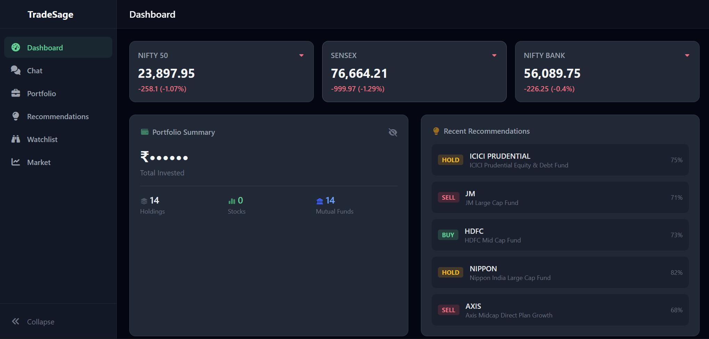
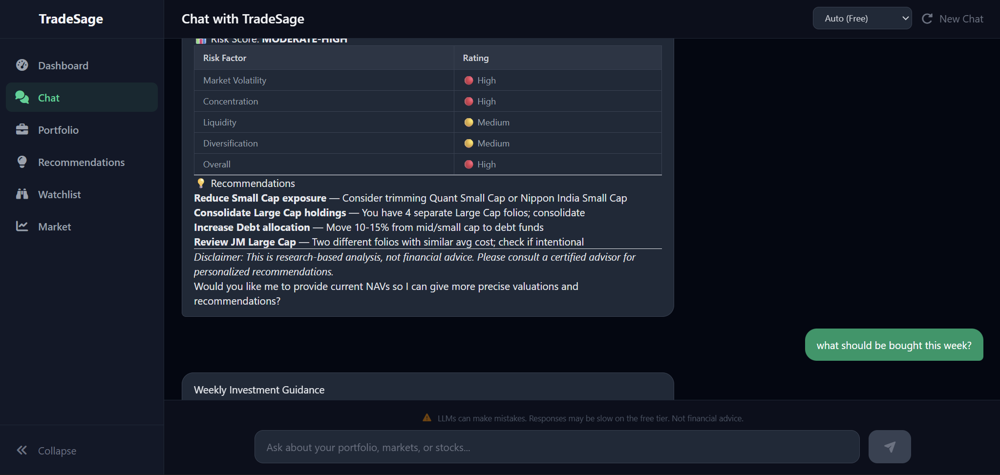
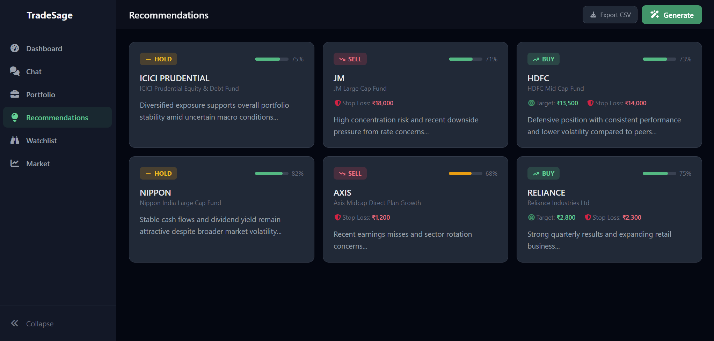

# TradeSage

An AI-powered trading research assistant for the Indian stock market. Analyze your portfolio, get LLM-driven buy/sell/hold recommendations, track market data, and chat with an AI advisor -- all from a local-first dark-themed terminal UI.

## Screenshots

| Dashboard | Chat | Recommendations |
|:-:|:-:|:-:|
|  |  |  |

## Features

### Portfolio Management
- **CSV Import** -- Import holdings via a standard CSV schema (symbol, name, type, quantity, avg_price, sector)
- **Live Valuation** -- Fetch current market prices for all stock holdings via yfinance. View current value, P&L (absolute + %), and day change per holding
- **Privacy Toggle** -- Eye icon to mask all monetary values across the app
- **Sector Allocation** -- Horizontal bar chart showing portfolio distribution by sector

### AI Chat
- **Streaming Chat** -- Conversational interface with SSE streaming, markdown rendering (tables, code, lists)
- **Model Selector** -- Switch between free LLM models (GLM 4.5, Gemma 3n, LFM 2.5, Auto) from the chat header
- **Portfolio-Aware** -- Every chat message includes your portfolio holdings and recent news as context
- **Conversation Persistence** -- Chat history stored in SQLite

### Recommendations
- **LLM-Generated** -- AI-powered buy/sell/hold recommendations with confidence scores, target prices, and stop losses
- **Structured Output** -- Prompt engineering enforces consistent JSON output from the LLM
- **Export CSV** -- Download recommendations as a CSV file

### Stock Drill-Down
- Click any holding in the portfolio table to open a modal with current quote and 6-month price chart

### Watchlist
- Track stocks you don't own but want to monitor
- Live price and day change displayed on each card

### Market Data
- **Indian Indices** -- Nifty 50, Sensex, Bank Nifty with real-time-ish data from yfinance
- **Stock Lookup** -- Search any NSE symbol, view quote details and 6-month historical chart

### Dashboard
- Aggregated view: market indices, portfolio summary, recent recommendations, and news feed
- Single API call powers the entire page

### News
- RSS feed aggregation from Economic Times, Moneycontrol, and Livemint
- Relative timestamps (e.g. "5m ago", "3h ago")

## Tech Stack

### Backend
- **FastAPI** -- async Python web framework
- **SQLAlchemy + aiosqlite** -- async SQLite ORM
- **OpenRouter SDK** -- LLM access (300+ models via single API)
- **yfinance** -- market data (NSE/BSE stocks, indices, historical OHLCV)
- **feedparser + httpx** -- RSS news aggregation

### Frontend
- **Vue 3** -- Composition API with `<script setup>`
- **Tailwind CSS** -- dark trading terminal theme
- **Chart.js + vue-chartjs** -- bar charts, line charts
- **Animate.css** -- staggered entrance animations
- **Font Awesome** -- icons throughout
- **marked** -- markdown rendering in chat

## Project Structure

```
tradesage/
├── backend/
│   ├── main.py                    # FastAPI app, CORS, lifespan, routes
│   ├── app/
│   │   ├── config.py              # Pydantic settings (.env loading)
│   │   ├── db/
│   │   │   ├── database.py        # Async SQLite engine + session
│   │   │   └── models.py          # Holding, ChatMessage, Recommendation, Watchlist
│   │   ├── routers/
│   │   │   ├── portfolio.py       # CRUD, CSV import, live valuation
│   │   │   ├── chat.py            # LLM chat with SSE streaming
│   │   │   ├── market.py          # Indices, quotes, history
│   │   │   ├── recommendations.py # LLM-powered recommendations + CSV export
│   │   │   ├── watchlist.py       # Watchlist CRUD with live prices
│   │   │   ├── dashboard.py       # Aggregated dashboard endpoint
│   │   │   └── news.py            # RSS news feed
│   │   ├── services/
│   │   │   ├── llm.py             # OpenRouter SDK client
│   │   │   ├── market_data.py     # yfinance wrapper
│   │   │   ├── csv_parser.py      # Portfolio CSV parser
│   │   │   └── news.py            # RSS feed fetcher
│   │   └── prompts/
│   │       └── system.py          # System + recommendation prompts
│   └── pyproject.toml
├── frontend/
│   ├── src/
│   │   ├── views/                 # Dashboard, Chat, Portfolio, Recommendations, Watchlist, Market
│   │   ├── components/            # Layout (Sidebar, PageHeader), Dashboard cards
│   │   ├── composables/           # useChat, usePortfolio, useDashboard, useMarket, useRecommendations, usePrivacy
│   │   ├── api/client.js          # Axios + SSE fetch
│   │   ├── utils/format.js        # Shared formatNum, formatTime, actionClass
│   │   └── router/index.js
│   └── package.json
└── README.md
```

## Setup

### Prerequisites
- Python 3.14+ with [uv](https://docs.astral.sh/uv/)
- Node.js 18+
- [OpenRouter API key](https://openrouter.ai/settings/keys) (free tier works)

### Backend

```bash
cd backend
cp .env.example .env
# Edit .env and add your OPENROUTER_API_KEY

uv sync
uv run uvicorn main:app --reload
```

The backend runs on `http://localhost:8000`. SQLite database is created automatically on first start.

### Frontend

```bash
cd frontend
npm install
npm run dev
```

The frontend runs on `http://localhost:5173` and proxies `/api` requests to the backend.

### CSV Import Format

Your portfolio CSV must have these columns:

| Column | Required | Description |
|--------|----------|-------------|
| `symbol` | Yes | Ticker symbol (e.g. RELIANCE) or MF scheme code |
| `name` | Yes | Company or scheme name |
| `type` | Yes | `STOCK` or `MF` |
| `quantity` | Yes | Number of shares or MF units |
| `avg_price` | Yes | Average purchase price or NAV |
| `sector` | No | Sector classification |

Example:
```csv
symbol,name,type,quantity,avg_price,sector
RELIANCE,Reliance Industries Ltd,STOCK,15,2430.50,Energy
INFY,Infosys Ltd,STOCK,40,1565.75,IT
INF209K01YS4,SBI Bluechip Fund,MF,250.50,72.35,
```

## API Endpoints

| Method | Endpoint | Description |
|--------|----------|-------------|
| `GET` | `/api/health` | Health check |
| `GET` | `/api/dashboard` | Aggregated dashboard data |
| `GET` | `/api/models` | Available LLM models |
| `GET` | `/api/portfolio/holdings` | List holdings |
| `GET` | `/api/portfolio/valuation` | Live portfolio valuation |
| `GET` | `/api/portfolio/csv-schema` | Expected CSV format |
| `POST` | `/api/portfolio/import` | Upload CSV |
| `DELETE` | `/api/portfolio/holdings` | Clear holdings |
| `POST` | `/api/chat` | Chat with LLM (SSE streaming) |
| `GET` | `/api/chat/conversations/{id}` | Conversation history |
| `GET` | `/api/market/indices` | Nifty, Sensex, Bank Nifty |
| `GET` | `/api/market/quote/{symbol}` | Stock price quote |
| `GET` | `/api/market/history/{symbol}` | Historical OHLCV |
| `GET` | `/api/news` | Aggregated RSS news |
| `POST` | `/api/recommendations/generate` | Generate AI recommendations |
| `GET` | `/api/recommendations` | List saved recommendations |
| `GET` | `/api/recommendations/export` | Download as CSV |
| `GET` | `/api/watchlist` | List watchlist with prices |
| `POST` | `/api/watchlist` | Add to watchlist |
| `DELETE` | `/api/watchlist/{symbol}` | Remove from watchlist |

## Future Work

- **Agentic Trading** -- AI agent with broker API integration (Zerodha Kite, Groww) to auto-execute trades based on LLM recommendations with configurable risk limits and approval workflows
- **Scheduled Daily Analysis** -- Automated portfolio health check after market close, with insights pre-computed for the dashboard
- **Conversation History Sidebar** -- Browse and revisit past chat conversations from the UI
- **Portfolio Snapshots Over Time** -- Track portfolio value daily, visualize growth over weeks/months
- **Alerts & Notifications** -- "RELIANCE dropped 5% today" based on holdings
- **Settings Page** -- Configure API key, default model, and RSS feed URLs from the UI
- **Dark/Light Theme Toggle**
- **Technical Indicators** -- RSI, MACD, moving averages on stock charts

## Disclaimer

TradeSage is a research assistant, not a certified financial advisor. AI-generated recommendations are based on pattern matching and general financial knowledge. Always do your own research before making investment decisions.
